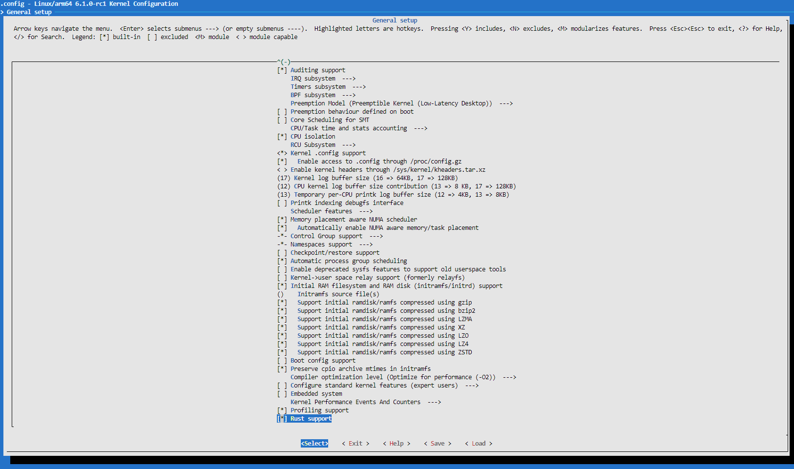
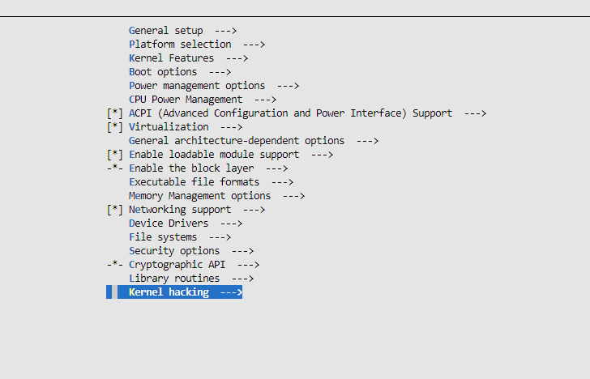
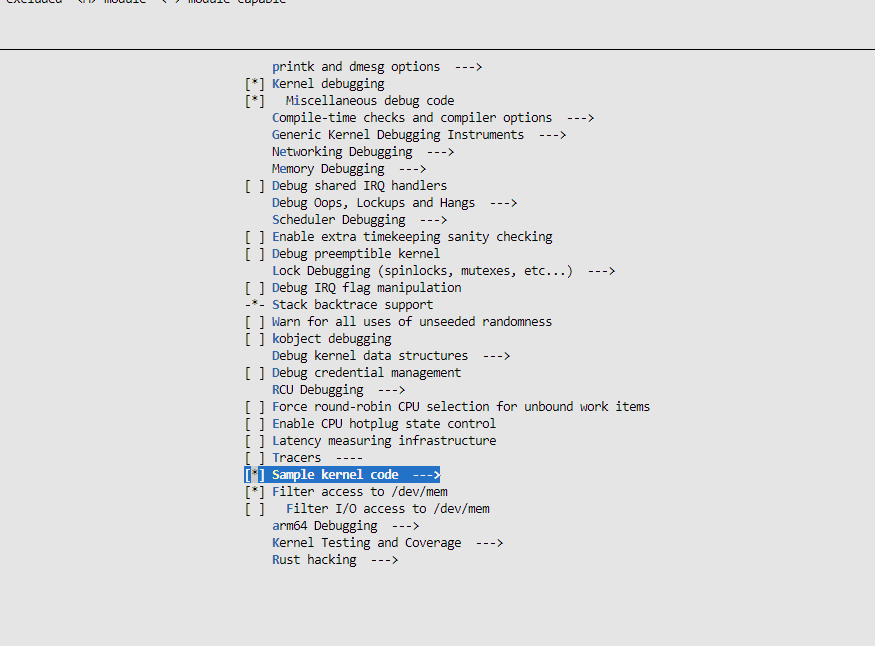
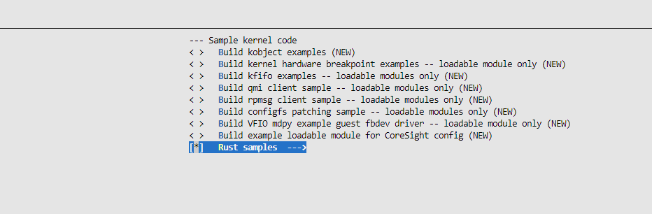
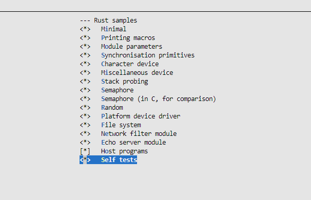
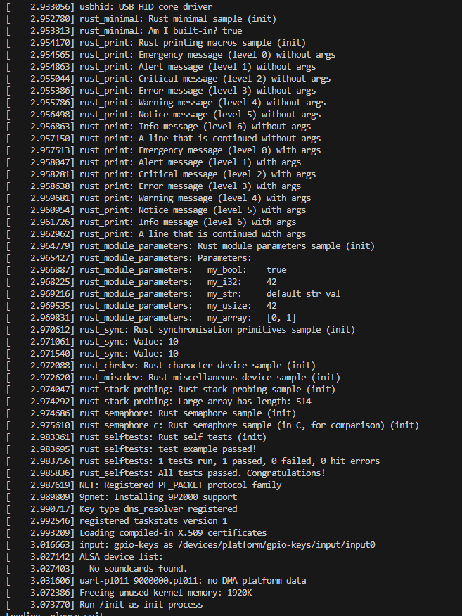

# Exercise 1
## 练习1: Rust for Linux 仓库源码获取，编译环境部署，及Rust内核编译。之后尝试在模拟器Qemu上运行起来。

主机系统：Windows 11

虚拟环境：wsl2 + Docker

选用镜像：Rust:latest

## 第一步：clone Linux源码

```
git clone git@github.com:fujita/linux.git -b rust-e1000
```


## 第二步：配置环境

安装构建工具：

```
apt-get update

apt-get -y install \
  binutils build-essential libtool texinfo \
  gzip zip unzip patchutils curl git \
  make cmake ninja-build automake bison flex gperf \
  grep sed gawk bc \
  zlib1g-dev libexpat1-dev libmpc-dev \
  libglib2.0-dev libfdt-dev libpixman-1-dev libelf-dev libssl-dev \
  clang-format clang-tidy clang-tools clang clangd libc++-dev libc++1 \
  libc++abi-dev libc++abi1 libclang-dev libclang1 liblldb-dev \
  libllvm-ocaml-dev libomp-dev libomp5 lld lldb llvm-dev \
  llvm-runtime llvm python3-clang \
  clang llvm
```

在linux目录下执行 `make LLVM=1 rustavailable`，出现报错，提示如下：

```
***
*** Rust bindings generator 'bindgen' could not be found.
***
```

显然我没有安装bindgen，在linux/Documentation/rust/quick-start.rst中介绍了bindgen的安装，需要执行下面的命令：

```
cargo install --locked --version $(scripts/min-tool-version.sh bindgen) bindgen
```

重新在linux目录下执行 `make LLVM=1 rustavailable`，再次报错，提示如下：

```
***
*** Rust compiler 'rustc' is too new. This may or may not work.
***   Your version:     1.73.0
***   Expected version: 1.62.0
***
***
*** Source code for the 'core' standard library could not be found
*** at '/usr/local/rustup/toolchains/1.73.0-x86_64-unknown-linux-gnu/lib/rustlib/src/rust/library/core/src/lib.rs'.
***
```

由提示可知rustc的版本太新了，此时需要执行：

```
rustup override set $(scripts/min-tool-version.sh rustc)
```

这条命令会下载指定版本的rustc，再次在linux目录下执行 `make LLVM=1 rustavailable`，报错，提示如下：

```
***
*** Source code for the 'core' standard library could not be found
*** at '/usr/local/rustup/toolchains/1.62.0-x86_64-unknown-linux-gnu/lib/rustlib/src/rust/library/core/src/lib.rs'.
***
```

此时还没有下载标准库，需要执行 `rustup component add rust-src` 来下载标准库。再次执行 `make LLVM=1 rustavailable`，打印如下信息：

```
Rust is available!
```

说明环境配置成功。

## 第三步：构建内核

执行以下命令，生成配置文件

```
make ARCH=arm64 LLVM=1 O=build defconfig
make ARCH=arm64 LLVM=1 O=build menuconfig
```

添加 rust support





之后执行以下命令，开始编译

```
cd build
make ARCH=arm64 LLVM=1 -j8
```


出现错误，需要下载 rustfmt，需要执行：

```
rustup component add rustfmt --toolchain 1.62.0-x86_64-unknown-linux-gnu
```

重新编译成功


## 第四步：在qemu中运行

下载 qemu 压缩包，我这里用的是 qemu-7.0.0

```
wget https://download.qemu.org/qemu-7.0.0.tar.xz
```

解压

```
tar xvJf qemu-7.0.0.tar.xz
```

安装

```
cd qemu-7.0.0
./configure --target-list=aarch64-softmmu,aarch64-linux-user
make -j8 && make install
```

下载 debian 镜像（有根文件系统），解压后如下：

```
dqib_arm64-virt
|-- image.qcow2
|-- initrd
|-- kernel
|-- readme.txt
|-- ssh_user_ecdsa_key
|-- ssh_user_ed25519_key
`-- ssh_user_rsa_key

1 directory, 7 files
```

根据 `readme.txt` 中的内容，执行：

```
qemu-system-aarch64 -machine 'virt' -cpu 'cortex-a57' -m 1G -device virtio-blk-device,drive=hd -drive file=image.qcow2,if=none,id=hd -device virtio-net-device,netdev=net -netdev user,id=net,hostfwd=tcp::2222-:22 -kernel kernel -initrd initrd -nographic -append "root=LABEL=rootfs console=ttyAMA0"
```

能正常运行说明文件没有损坏

接下来编译 Rust samples, 在linux目录下执行：

```
make ARCH=arm64 LLVM=1 O=build menuconfig
```

按下图选择（注意以built-in方式编译，如果以模块编译则无法在启动时看到输出，因为模块还没有载入内核）：









保存之后编译：

```
cd build
make ARCH=arm64 LLVM=1 -j8
```

将 linux/build/arch/arm64/boot/Image 拷贝到 dqib_arm64-virt 目录下

```
cp linux/build/arch/arm64/boot/Image dqib_arm64-virt/Image
```

在 qemu 运行（将 `-kernel kernel` 换成 `-kernel Image`）：

```
cd dqib_arm64-virt
qemu-system-aarch64 -machine 'virt' -cpu 'cortex-a57' -m 1G -device virtio-blk-device,drive=hd -drive file=image.qcow2,if=none,id=hd -device virtio-net-device,netdev=net -netdev user,id=net,hostfwd=tcp::2222-:22 -kernel Image -initrd initrd -nographic -append "root=LABEL=rootfs console=ttyAMA0"
```

运行结果如下：

