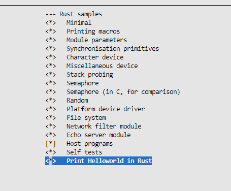
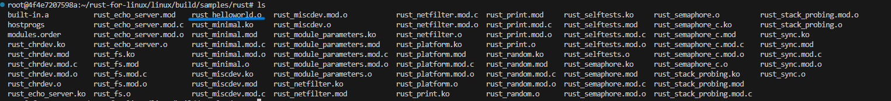
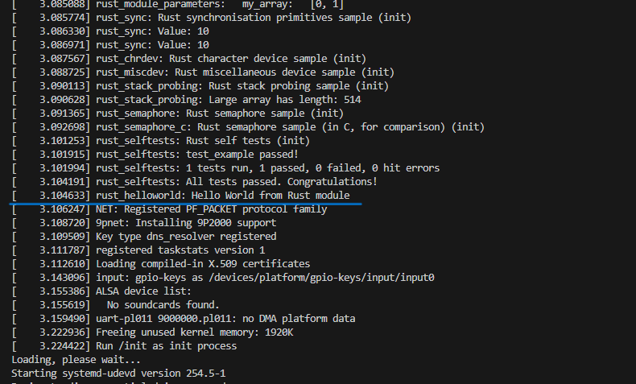

# Exercise 2

## 练习2: 自定义编写Rust内核驱动模块

主机系统：Windows 11

虚拟环境：wsl2 + Docker

选用镜像：Rust:latest

## 第一步：编写Rust驱动程序

进入 `linux/samples/rust` 目录

```
cd linux/samples/rust
```

创建rust源文件

```
touch rust_helloworld.rs
```

将以下内容写入此文件

```
// SPDX-License-Identifier: GPL-2.0
//! Rust minimal sample.
      
use kernel::prelude::*;
      
module! {
  type: RustHelloWorld,
  name: "rust_helloworld",
  author: "whocare",
  description: "hello world module in rust",
  license: "GPL",
}
      
struct RustHelloWorld {}
      
impl kernel::Module for RustHelloWorld {
  fn init(_name: &'static CStr, _module: &'static ThisModule) -> Result<Self> {
      pr_info!("Hello World from Rust module");
      Ok(RustHelloWorld {})
  }
}
```

## 第二步：修改 Makefile 和 Kconfig 文件

修改 `linux/samples/rust` 目录中的 `Makefile` 文件，添加下面的内容

```
obj-$(CONFIG_SAMPLE_RUST_HELLOWORLD)        += rust_helloworld.o
```

修改 `linux/samples/rust` 目录中的 `Kconfig` 文件，添加下面的内容

```
config SAMPLE_RUST_HELLOWORLD
  tristate "Print Helloworld in Rust"
  help
    This option builds the Rust HelloWorld module sample.
      
    To compile this as a module, choose M here:
    the module will be called rust_helloworld.
      
    If unsure, say N.
```

在 linux 目录下执行：

```
make ARCH=arm64 LLVM=1 O=build menuconfig
```

选上 Print Helloworld in Rust，如下图：



编译内核：

```
cd build
make ARCH=arm64 LLVM=1 -j8
```

编译成功后可以在 `samples/rust` 目录下看到 `rust_helloworld.ko`



将 linux/build/arch/arm64/boot/Image 拷贝到 dqib_arm64-virt 目录下

```
cp linux/build/arch/arm64/boot/Image dqib_arm64-virt/Image
```

在 qemu 运行（将 `-kernel kernel` 换成 `-kernel Image`）：

```
cd dqib_arm64-virt
qemu-system-aarch64 -machine 'virt' -cpu 'cortex-a57' -m 1G -device virtio-blk-device,drive=hd -drive file=image.qcow2,if=none,id=hd -device virtio-net-device,netdev=net -netdev user,id=net,hostfwd=tcp::2222-:22 -kernel Image -initrd initrd -nographic -append "root=LABEL=rootfs console=ttyAMA0"
```

运行结果如下：



